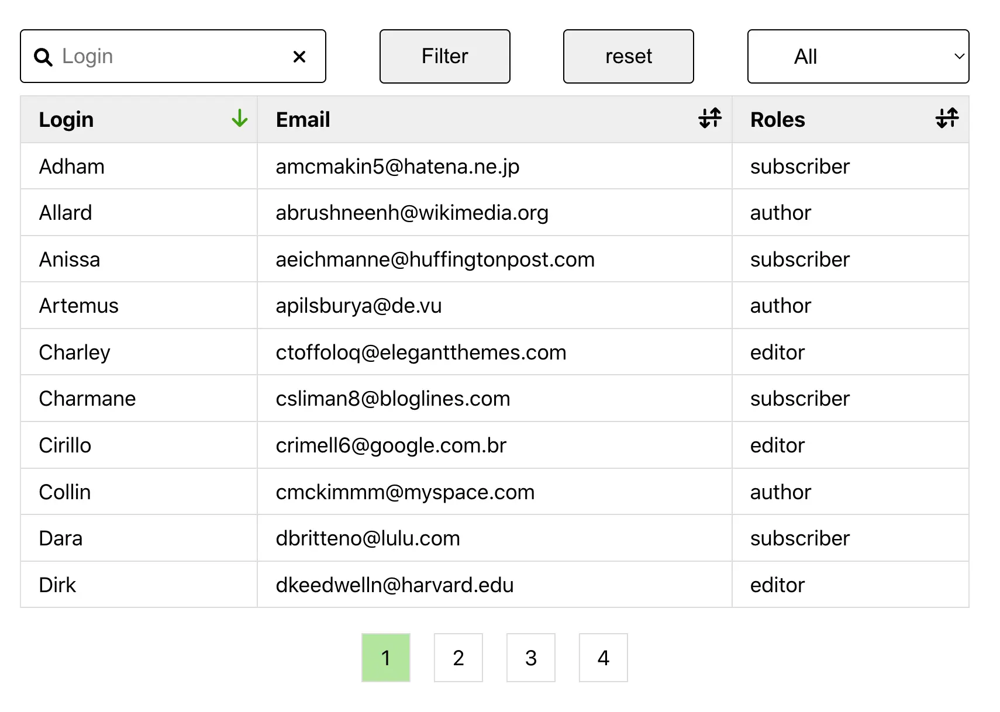

# Plugin for Wordpress

Which shows table of users.

Specification:

1) Create a plugin(or inside themes functions) that creates a custom HTML table.
2) Print the HTML table to frontend via shortcode code or a Gutenberg block.
3) The table must have a list of users that we can filter by role and order them in alphabetical order by display_name and username (both options available please).
4) The role filter and ordering must both work via AJAX, and please add a pagination with ten users per page (number can be hardcoded) that works via AJAX as well. 
5) For ordering, you can attach a font-awesome icons(ASC/DESC) for each table header.
6) Import all 30(+your admin user) users(file attached) into WordPress. - You can import directly to the database. No need to create import functionality.
7) Please give the table a basic styling for desktop view. No need to make it responsive.

Please treat this test as if it were your client and hired you to do it, and act/deliver accordingly.

Rules:

- Please don't use the class WP_List_Table to create the table.
- The list must be visible only to the admin user.
- Ordering must work in both ascending and descending directions.
- If sorting order or what we're sorting by changes, maintain the current role filter but go to the first page.
- If what role we are filtering by changes, go to the first page with default sorting order and default what we're sorting by.
- If pagination changes, maintain the current sorting order, what we're sorting by, and what role we're filtering by, and go to that page.
- We require that you follow a coding standard. We prefer the WP coding standard because it makes it easier to collaborate with other people.
